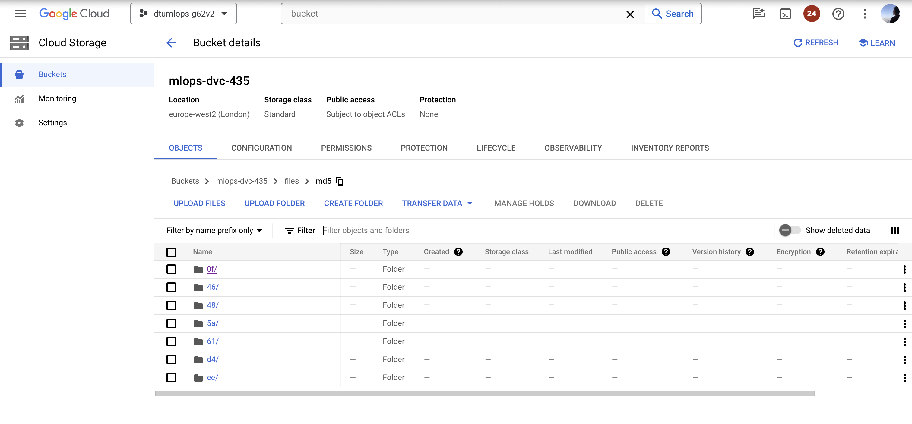
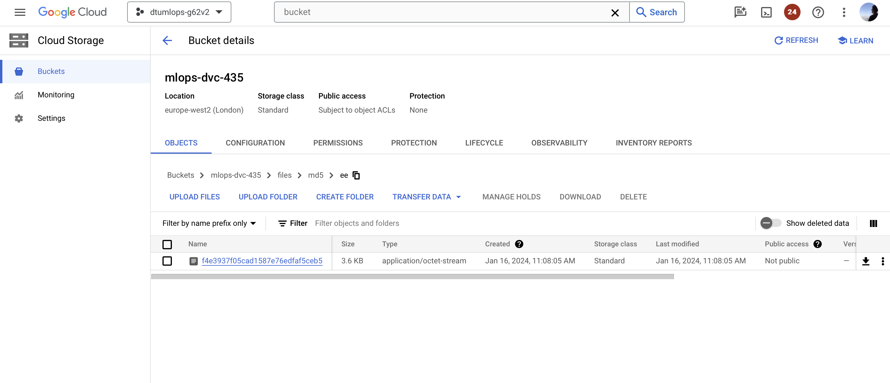
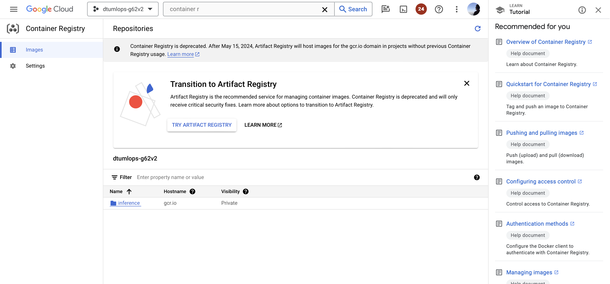
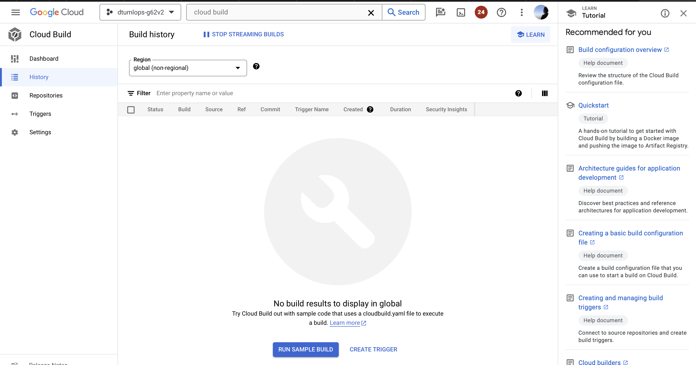
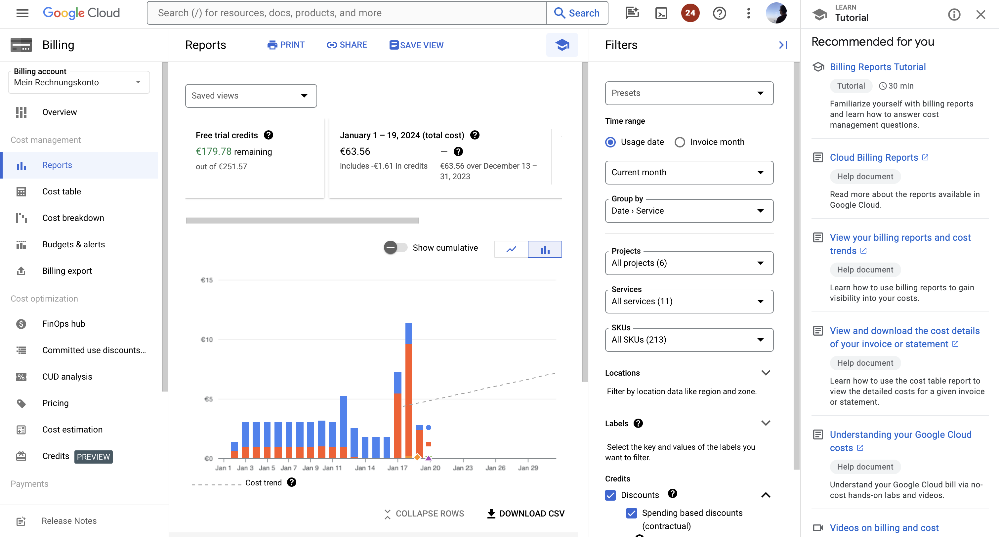

# Exam template for 02476 Machine Learning Operations

This is the report template for the exam. Please only remove the text formatted as with three dashes in front and behind
like:

```--- question 1 fill here ---```

where you instead should add your answers. Any other changes may have unwanted consequences when your report is auto
generated in the end of the course. For questions where you are asked to include images, start by adding the image to
the `figures` subfolder (please only use `.png`, `.jpg` or `.jpeg`) and then add the following code in your answer:

```markdown

```

In addition to this markdown file, we also provide the `report.py` script that provides two utility functions:

Running:

```bash
python report.py html
```

will generate an `.html` page of your report. After deadline for answering this template, we will autoscrape
everything in this `reports` folder and then use this utility to generate an `.html` page that will be your serve
as your final handin.

Running

```bash
python report.py check
```

will check your answers in this template against the constrains listed for each question e.g. is your answer too
short, too long, have you included an image when asked to.

For both functions to work it is important that you do not rename anything. The script have two dependencies that can
be installed with `pip install click markdown`.

## Overall project checklist

The checklist is *exhaustic* which means that it includes everything that you could possible do on the project in
relation the curricilum in this course. Therefore, we do not expect at all that you have checked of all boxes at the
end of the project.

### Week 1

* [X] Create a git repository
* [X] Make sure that all team members have write access to the github repository
* [X] Create a dedicated environment for you project to keep track of your packages
* [X] Create a dedicated environment for you project to keep track of your packages
* [X] Create the initial file structure using cookiecutter
* [X] Fill out the `make_dataset.py` file such that it downloads whatever data you need and
* [X] Add a model file and a training script and get that running
* [X] Remember to fill out the `requirements.txt` file with whatever dependencies that you are using
* [X] Remember to comply with good coding practices (`pep8`) while doing the project
* [X] Do a bit of code typing and remember to document essential parts of your code
* [X] Setup version control for your data or part of your data
* [X] Construct one or multiple docker files for your code
* [X] Build the docker files locally and make sure they work as intended
* [X] Write one or multiple configurations files for your experiments
* [X] Used Hydra to load the configurations and manage your hyperparameters
* [X] When you have something that works somewhat, remember at some point to to some profiling and see if
* [X] Used Hydra to load the configurations and manage your hyperparameters
* [X] When you have something that works somewhat, remember at some point to to some profiling and see if
      you can optimize your code
* [X] Use Weights & Biases to log training progress and other important metrics/artifacts in your code. Additionally,
* [X] Use Weights & Biases to log training progress and other important metrics/artifacts in your code. Additionally,
      consider running a hyperparameter optimization sweep.
* [X] Use Pytorch-lightning (if applicable) to reduce the amount of boilerplate in your code

### Week 2

* [X] Write unit tests related to the data part of your code
* [X] Write unit tests related to model construction and or model training
* [X] Calculate the coverage. (14.01 -> 97%)
* [X] Get some continuous integration running on the github repository
* [X] Create a data storage in GCP Bucket for you data and preferable link this with your data version control setup
* [X] Create a trigger workflow for automatically building your docker images
* [X] Get your model training in GCP using either the Engine or Vertex AI
* [X] Create a FastAPI application that can do inference using your model
* [X] If applicable, consider deploying the model locally using torchserve
* [X] Deploy your model in GCP using either Functions or Run as the backend

### Week 3

* [ ] Check how robust your model is towards data drifting
* [X] Setup monitoring for the system telemetry of your deployed model
* [ ] Setup monitoring for the performance of your deployed model
* [ ] If applicable, play around with distributed data loading
* [ ] If applicable, play around with distributed model training
* [ ] Play around with quantization, compilation and pruning for you trained models to increase inference speed

### Additional

* [X] Revisit your initial project description. Did the project turn out as you wanted?
* [X] Make sure all group members have a understanding about all parts of the project
* [X] Uploaded all your code to github

## Group information

### Question 1
> **Enter the group number you signed up on <learn.inside.dtu.dk>**
>
> Answer:

--- 62 ---

### Question 2
> **Enter the study number for each member in the group**
>
> Example:
>
> *sXXXXXX, sXXXXXX, sXXXXXX*
>
> Answer:

--- s232429, s232002, s231954 ---

### Question 3
> **What framework did you choose to work with and did it help you complete the project?**
>
> Answer length: 100-200 words.
>
> Example:
> *We used the third-party framework ... in our project. We used functionality ... and functionality ... from the*
> *package to do ... and ... in our project*.
>
> Answer:

--- We used the third-party framework "tsai", it is an open-source deep learning package built on top of Pytorch & fastai focused on state-of-the-art techniques for time series tasks like classification, regression, forecasting, imputation etc. It is actively developed by timeseriesAI. We used already build in model (TSForecaster class), from tsai to define our model, we also used build in functions like fit_one_cycle() from the same package to train our model or get_forecasting_splits() to split data, which facilitated development process significantly. Standard functionalities from popular packages like sklearn or numpy were also used. Moreover we used tutorials provided by timeseriesAI to develop and align our model. ---

## Coding environment

> In the following section we are interested in learning more about you local development environment.

### Question 4

> **Explain how you managed dependencies in your project? Explain the process a new team member would have to go**
> **through to get an exact copy of your environment.**
>
> Answer length: 100-200 words
>
> Example:
> *We used ... for managing our dependencies. The list of dependencies was auto-generated using ... . To get a*
> *complete copy of our development environment, one would have to run the following commands*
>
> Answer:

--- We used conda for managing our dependencies. The list of dependencies was auto-generated using pipreqs. At the beginning of the project we agreed to use version 3.11 of python. Dependencies were updated on the ongoing basis via github, so whenever they changed on our master branch each contributor were able to update them locally. To get a complete copy of our development environment, one would have to run the following commands:
1. Install conda (might differ among different operating systems, please refer to the official documentation)
2. conda create -n myenv python=3.11
3. conda activate myenv
4. pip install -r requirements.txt ---

### Question 5

> **We expect that you initialized your project using the cookiecutter template. Explain the overall structure of your**
> **code. Did you fill out every folder or only a subset?**
>
> Answer length: 100-200 words
>
> Example:
> *From the cookiecutter template we have filled out the ... , ... and ... folder. We have removed the ... folder*
> *because we did not use any ... in our project. We have added an ... folder that contains ... for running our*
> *experiments.*
> Answer:

--- From the cookiecutter template we have filled out every provided folder, beside docs. At the moment of reading this report it might be filled in, however we left it as the last thing to do. The "models" folder might be empty, however we were actively using it to store our models (in .pt format) locally, we didn't push changes within this folder to keep our repository neat. We have added "notebooks" directory where we have been experimenting with our model, the notebook is aligned copy of the jupyter nb provided by tsai. The "insfrastructure" directory was also added in order to setup GCP and deploy. ---

### Question 6

> **Did you implement any rules for code quality and format? Additionally, explain with your own words why these**
> **concepts matters in larger projects.**
>
> Answer length: 50-100 words.
>
> Answer:

--- We used mainly ruff formating top be complaiant with PEP8. These concepts are helpful even in the smaller projects like this one, with the bigger ones I would risk to say that they are inevitable. They simply facelitate the entire work, as each developer knows what to expect from code. ---

## Version control

> In the following section we are interested in how version control was used in your project during development to
> corporate and increase the quality of your code.

### Question 7

> **How many tests did you implement and what are they testing in your code?**
>
> Answer length: 50-100 words.
>
> Example:
> *In total we have implemented X tests. Primarily we are testing ... and ... as these the most critical parts of our*
> *application but also ... .*
>
> Answer:

--- In total we have implemented 7 tests. We are testing corectness of data such as if data arrays have expected shapes, if types are as expected, if all values are represented (no infinite or Nan values etc.). Moreover we are testing main model fuctionalities such as data loading, training or model saving. ---

### Question 8

> **What is the total code coverage (in percentage) of your code? If you code had an code coverage of 100% (or close**
> **to), would you still trust it to be error free? Explain you reasoning.**
>
> Answer length: 100-200 words.
>
> Example:
> *The total code coverage of code is X%, which includes all our source code. We are far from 100% coverage of our **
> *code and even if we were then...*
>
> Answer:

--- The total code coverage of code is 97%, it was tested with "coverage" tool on all our source code. Even though this value is close to 100%, we are more than certain that our code is not error-free. Our unit tests cover almost every line, demonstrating which indicates that they can run without an error. However, they have their limitations. They might ensure each line is executed, but they don't encompass every possible way these lines might be used in real-world scenarios. This is a critical distinction because real-world usage often presents cases that our controlled test environments fail to anticipate. ---

### Question 9

> **Did you workflow include using branches and pull requests? If yes, explain how. If not, explain how branches and**
> **pull request can help improve version control.**
>
> Answer length: 100-200 words.
>
> Example:
> *We made use of both branches and PRs in our project. In our group, each member had an branch that they worked on in*
> *addition to the main branch. To merge code we ...*
>
> Answer:

--- In our project, we used both branches and pull requests (PRs). For each separate feature, we created a dedicated branch, and following its merge, we removed it from the main repository. The main branch was our base, and all contributions to it were strictly through PRs. This process involved reviews of the most important features before their integration. Additionally, our workflow often included working on separate forks, providing a parallel development environment. This approach allowed us to maintain a clean, organized codebase and facilitated efficient collaboration among team members. This methodology is used to carefully manage code via review of code changes to ensure quality and consistency in project development. ---

### Question 10

> **Did you use DVC for managing data in your project? If yes, then how did it improve your project to have version**
> **control of your data. If no, explain a case where it would be beneficial to have version control of your data.**
>
> Answer length: 100-200 words.
>
> Example:
> *We did make use of DVC in the following way: ... . In the end it helped us in ... for controlling ... part of our*
> *pipeline*
>
> Answer:

--- We did make use of DVC in the following way: DVC is used in two places - github actions and in the cloud during model training. The data are stored in the bucket in google cloud. It greatly improved the way we are handling our data, since we are sure that we are using the same data in CI and in model training, morever it freed github space from data. Although, our data didn't take tremendous amount of disk space at this stage of the project we are somehow prodected from the case of traing the model on larger datasets.---

### Question 11

> **Discuss you continues integration setup. What kind of CI are you running (unittesting, linting, etc.)? Do you test**
> **multiple operating systems, python version etc. Do you make use of caching? Feel free to insert a link to one of**
> **your github actions workflow.**
>
> Answer length: 200-300 words.
>
> Example:
> *We have organized our CI into 3 separate files: one for doing ..., one for running ... testing and one for running*
> *... . In particular for our ..., we used ... .An example of a triggered workflow can be seen here: <weblink>*
>
> Answer:

--- We have organised our CI into two files in which we are testing the corectness of the data and main model functionalities as well compatibility with good coding practicies. We are running unitesting (7 tests in total) and ruff. In both cases we are running our pipeline on push event and pull request to master branch. 

CI for unit tests:
We are testing it for ubuntu, macos and windows operating systems (all marked as latest). In the test we are setting up the entire development, then we are installing dependecies. Throughout this process we are making use of cashing, which improves tests speed. Finally we are testing our code with pytest

An example of triggered workflow can be seen here:
https://github.com/corusm/mlops-project/actions/runs/7530338558/job/20496483800


CI for ruff:
We are also continously checking our code compatibilty with good coding practicies. We decided to use ruff due to it's speed, it was configured to keep line width of 120 lines (configured in pyproject.toml file). Entire process is very simmilar to the one described with unittesting.
1. We are testing on Windows, MacOS and Ubuntu
2. Installing dependencies utilizing caching
3. running 'ruff check' and 'ruff format' on the entire code.

An example of triggered workflow can be seen here:
https://github.com/corusm/mlops-project/actions/runs/7535717724/job/20512110831?pr=9 ---

## Running code and tracking experiments

> In the following section we are interested in learning more about the experimental setup for running your code and
> especially the reproducibility of your experiments.

### Question 12

> **How did you configure experiments? Did you make use of config files? Explain with coding examples of how you would**
> **run a experiment.**
>
> Answer length: 50-100 words.
>
> Example:
> *We used a simple argparser, that worked in the following way: python my_script.py --lr 1e-3 --batch_size 25*
>
> Answer:

--- We used config files ---

### Question 13

> **Reproducibility of experiments are important. Related to the last question, how did you secure that no information**
> **is lost when running experiments and that your experiments are reproducible?**
>
> Answer length: 100-200 words.
>
> Example:
> *We made use of config files. Whenever an experiment is run the following happens: ... . To reproduce an experiment*
> *one would have to do ...*
>
> Answer:

---Our workflow is pretty straightforward: code on GitHub gets trained in the cloud, and then the trained model, along with all the details, gets saved to wandb. If you want to rerun an experiment, just grab the specific code version from GitHub, pull the model parameters and hyperparameter setup from wandb, and run it all again in the cloud. This setup not only keeps our data safe and sound but also makes it quite simple to replicate any experiment. We also used config files for hyperparameters, which helped us to handle them in an organized way, keeping our experiment settings clear and easy to adjust. ---

### Question 14

> **Upload 1 to 3 screenshots that show the experiments that you have done in W&B (or another experiment tracking**
> **service of your choice). This may include loss graphs, logged images, hyperparameter sweeps etc. You can take**
> **inspiration from [this figure](figures/wandb.png). Explain what metrics you are tracking and why they are**
> **important.**
>
> Answer length: 200-300 words + 1 to 3 screenshots.
>
> Example:
> *As seen in the first image when have tracked ... and ... which both inform us about ... in our experiments.*
> *As seen in the second image we are also tracking ... and ...*
>
> Answer:

--- question 14 fill here ---

### Question 15

> **Docker is an important tool for creating containerized applications. Explain how you used docker in your**
> **experiments? Include how you would run your docker images and include a link to one of your docker files.**
>
> Answer length: 100-200 words.
>
> Example:
> *For our project we developed several images: one for training, inference and deployment. For example to run the*
> *training docker image: `docker run trainer:latest lr=1e-3 batch_size=64`. Link to docker file: <weblink>*
>
> Answer:

--- For our project, we developed several Docker images:

Docker images for training: Inside one container, we run three scripts sequentially (make_dataset -> train_model -> visualize). Other images are running in the cloud.

Docker image for inference: This Dockerfile is used to deploy an app in the cloud.

Building all of the Dockerfiles is managed via GitHub Actions (see `.github/workflows`). Dockerfiles for training are always built. When the training is finished, the Docker image for deployment is built. 
Links to images: 
- ghcr.io/corusm/train-basemodel:latest (public available, `dockerfiles/train_model.gpu.dockerfile`)
- gcr.io/dtumlops-g62v2/inference:latest (build via github actions and pushed to gcp registry, `dockerfile/inference.dockerfile`)

Commands: 
docker build -t ghcr.io/corusm/train-basemodel:latest -f ./dockerfiles/train_model.gpu.dockerfile .
docker push ghcr.io/corusm/train-basemodel:latest

docker build -t gcr.io/dtumlops-g62v2/inference:latest -f ./dockerfiles/inference.dockerfile --build-arg HTTP_PORT=8080 .
docker push gcr.io/dtumlops-g62v2/inference:latest

`but all commands are automated via github actions`

---

### Question 16

> **When running into bugs while trying to run your experiments, how did you perform debugging? Additionally, did you**
> **try to profile your code or do you think it is already perfect?**
>
> Answer length: 100-200 words.
>
> Example:
> *Debugging method was dependent on group member. Some just used ... and others used ... . We did a single profiling*
> *run of our main code at some point that showed ...*
>
> Answer:

--- Each member has it's own method for debugging, however what is common for all of us is the love for the print statement as it solved for us most of the problems. To track more complex bugs we used build in debugger for VS Code. 
In terms of profiling - we checked our code once, CPU spends the most time on running cudaLauchKernel (~20%), which is expected since it is called to lauch a device fuction, which is a code that is run on a GPU. Moreover we are spending some time on the following operations: aten::linear (most of the time is spend in the fuctions it calls), aten::im2col (used to reformat data) and aten::matmul (used for matrix multiplication). We didn't spend time to improve these results, since we considered them to be reasonable. ---

## Working in the cloud

> In the following section we would like to know more about your experience when developing in the cloud.

### Question 17

> **List all the GCP services that you made use of in your project and shortly explain what each service does?**
>
> Answer length: 50-200 words.
>
> Example:
> *We used the following two services: Engine and Bucket. Engine is used for... and Bucket is used for...*
>
> Answer:

1. **Google Cloud Storage (GCS)**: GCS, as seen in the `google_storage_bucket`, is used for storing and accessing data on Google's cloud. It provides a secure and scalable solution for data storage, including but not limited to, storing the artifacts and datasets required for machine learning operations.

2. **Google Cloud IAM (Identity and Access Management)**: Demonstrated by the `google_service_account` and `google_project_iam_member` resources, IAM is used to manage access control and permissions. It enables the creation of service accounts and assigns specific roles to these accounts, thereby controlling what actions they can perform within the GCP environment.

3. **Google Cloud Run**: Indicated in the `deploy-cloudrun` action, Cloud Run is a managed compute platform that enables the deployment of containerized applications. It's used here to deploy the inference service, providing a scalable and serverless environment for application execution.

4. **Google Cloud Build**: While not directly referenced, Cloud Build is implied in the Docker image build and push process. It's a service that executes your builds on Google Cloud Platform infrastructure, automating the build, test, and deployment process.

5. **Google Container Registry (GCR)**: Implied in the `docker/build-push-action`, GCR is a Docker container registry for storing, managing, and securing Docker container images. It's used here to store the built Docker images which are then deployed to Cloud Run.

6. **Workload Identity Federation**: This is indicated by the `workload_identity_provider` in GitHub Actions workflows. It allows GitHub Actions to impersonate a GCP service account, enabling secure authentication and authorization for automated workflows.

7. **Google Compute Engine:** Used in the CML setup to provide scalable and customizable compute capacity. It allows you to run and manage virtual machines on Google's infrastructure. In our project, it was used to deploy a runner with specific hardware (`nvidia-tesla-k80`) for machine learning tasks.
--- question 17 fill here ---

### Question 18

> **The backbone of GCP is the Compute engine. Explained how you made use of this service and what type of VMs**
> **you used?**
>
> Answer length: 100-200 words.
>
> Example:
> *We used the compute engine to run our ... . We used instances with the following hardware: ... and we started the*
> *using a custom container: ...*
>
> Answer:
1. **Runner VMs for GitHub Actions**: We employed Compute Engine VMs to host self-hosted runners for GitHub Actions, particularly for the machine learning model training and deployment. This is evident in the CML (Continuous Machine Learning) workflow, where a VM is dynamically launched on GCP to run the training job. The VM specification used was `n1-standard-1` with an additional `nvidia-tesla-k80` GPU, as specified in the `--cloud-type` parameter. This setup provided a balanced mix of CPU and GPU resources, suitable for our machine learning tasks.

2. **Custom Container for Training**: The training job was executed in a custom Docker container (`ghcr.io/corusm/train-basemodel:latest`), which was run on the Compute Engine VM. In the container we then pulled the data via DVC, installed requirements, and ran the training script. This was very lightweight, as the container wasn't changed very often, since we installed requirements etc. post-build.

--- question 18 fill here ---

### Question 19

> **Insert 1-2 images of your GCP bucket, such that we can see what data you have stored in it.**
> **You can take inspiration from [this figure](figures/bucket.png).**
>
> Answer:




--- question 19 fill here ---

### Question 20

> **Upload one image of your GCP container registry, such that we can see the different images that you have stored.**
> **You can take inspiration from [this figure](figures/registry.png).**
>
> Answer:

One image is stored in the github container registry and the other here in the GCP registry.


--- question 20 fill here ---

### Question 21

> **Upload one image of your GCP cloud build history, so we can see the history of the images that have been build in**
> **your project. You can take inspiration from [this figure](figures/build.png).**
>
> Answer:

We didn't use cloudbuild but terraform and github actions as this was more flexible for future cloud setups and better integrated in our CI/CD pipeline.


--- question 21 fill here ---

### Question 22

> **Did you manage to deploy your model, either in locally or cloud? If not, describe why. If yes, describe how and**
> **preferably how you invoke your deployed service?**
>
> Answer length: 100-200 words.
>
> Example:
> *For deployment we wrapped our model into application using ... . We first tried locally serving the model, which*
> *worked. Afterwards we deployed it in the cloud, using ... . To invoke the service an user would call*
> *`curl -X POST -F "file=@file.json"<weburl>`*
>
> Answer:

--- 
We deployed our model both locally and on the cloud, with the primary goal of deploying it within GCP. We initiated cloud deployment after successfully deploying the model locally. Our model is automatically deployed each time the training process completes in the cloud, with all actions managed via GitHub Actions. To interact with our deployed model, one needs to upload a .csv file that meets certain criteria. The simplest method is using the following command

curl -X 'POST' 'https://inference-d4wzaxb3la-uc.a.run.app/predict' -H 'accept: application/json' -H 'Content-Type: multipart/form-data' -F 'data=@cex4WindDataInterpolated.csv;type=text/csv' > out.png

This command requires a .csv file, and the resulting out.png will contain several predictions. It's important to note that the endpoint mentioned above is from an older sample and may not be operational now, as our cloud service has a specific set lifespan. ---

### Question 23

> **Did you manage to implement monitoring of your deployed model? If yes, explain how it works. If not, explain how**
> **monitoring would help the longevity of your application.**
>
> Answer length: 100-200 words.
>
> Example:
> *We did not manage to implement monitoring. We would like to have monitoring implemented such that over time we could*
> *measure ... and ... that would inform us about this ... behaviour of our application.*
>
> Answer:

We added a prometheus client to the FastAPI and had basic metrics within the managed cloud runner. Logs could be inspected there aswell easily. For a bigger setup we would have deployed a prometheus and grafana instance to monitor our application in a better way. Additionally projects like "great expectations" could help improve conitnuous data integration for our ML model.

--- question 23 fill here ---

### Question 24

> **How many credits did you end up using during the project and what service was most expensive?**
>
> Answer length: 25-100 words.
>
> Example:
> *Group member 1 used ..., Group member 2 used ..., in total ... credits was spend during development. The service*
> *costing the most was ... due to ...*
>
> Answer:

We spent 63.56€ in total. The biggest cost factor was the GPU within CML runner for accelerated training, but it helped us a lot, since training on every PC of us way way slower and sweep didn't really work well. But on the cloud it did.


--- question 24 fill here ---

## Overall discussion of project

> In the following section we would like you to think about the general structure of your project.

### Question 25

> **Include a figure that describes the overall architecture of your system and what services that you make use of.**
> **You can take inspiration from [this figure](figures/overview.png). Additionally in your own words, explain the**
> **overall steps in figure.**
>
> Answer length: 200-400 words
>
> Example:
>
> *The starting point of the diagram is our local setup, where we integrated ... and ... and ... into our code.*
> *Whenever we commit code and puch to github, it auto triggers ... and ... . From there the diagram shows ...*
>
> Answer:

--- 

The diagram shows overall architecture of our system.

The starting point of our setup is our GitHub repository, specifically the raw code. We utilize several frameworks, notably PyTorch and tsai, and the entire project template was initialized using Cookiecutter. We also make use of tools like Conda and Hydra for managing environments and configurations, respectively. Our code goes through testing via GitHub Actions, which includes tests of training and visualization process, coverage checks, etc.

Additionally, we build several Docker images; some are built in the GCP cloud, triggered via GitHub. For both GCP and GitHub tests, we use DVC for data storage, placed in a GCP bucket. After successful training of a specific model, the parameters are saved to Weights & Biases (wandb), and we deploy our model using a Docker image. During this deployment phase, we monitor inference with our service. The user-service communication is facilitated via FastAPI.

All of the cloud setup can be easly reproduced with terraform, this setup is included in infrastructure directory. Basically, by following the gcp_dvc_bucket.tf is a step by step instruction how to set up exactly same bucket in the google cloud, while svc-config.tf allows to reproduce the exact cloud setup. ---

### Question 26

> **Discuss the overall struggles of the project. Where did you spend most time and what did you do to overcome these**
> **challenges?**
>
> Answer length: 200-400 words.
>
> Example:
> *The biggest challenges in the project was using ... tool to do ... . The reason for this was ...*
>
> Answer:

--- The biggest challenges in the project was to use the third party module provided by TSAI as well as integrating everything in the google cloud.

Using TSAI module: 
Since it is relatively new product we have a feeling that it is still not mature enough, or we would have to work with it for much more time to use it effectively. Tutorials provided on their website are very helpful, however we felt like we are a little bit restrained by not knowing all of the possible functionalities. To overcome these features we followed provided tutorials quite tightly, which took a lot of flexibility from us.
To sum up -> framework is great and helps a lot, however we think that we could achieve much better results if it would be a little bit more user friendly.

Using google cloud:
None of us has previously used Google Cloud in a serious way and we came up with a conclusion, that it is quite unituitive and over complicated. We can't say that it is hard, more like time consuming, especially for newcomers. It is probably the same with AWS if one is doing it for the first time (so we might be just a little bit biased). We don't think that it is really an issue, however to overcome it we simply spend more time on it.

---

### Question 27

> **State the individual contributions of each team member. This is required information from DTU, because we need to**
> **make sure all members contributed actively to the project**
>
> Answer length: 50-200 words.
>
> Example:
> *Student sXXXXXX was in charge of developing of setting up the initial cookie cutter project and developing of the*
> *docker containers for training our applications.*
> *Student sXXXXXX was in charge of training our models in the cloud and deploying them afterwards.*
> *All members contributed to code by...*
>
> Answer:

--- All members contributed to code by 33.3 %
 
 - Student s232429 was in charge of setting up the initial cookie cutter project, adding github actions and aligning code to project structure (docker, formatting, profiling etc.)

 - Student s232002 was in charge of integrating Weights & Biases to log training progress and other important metrics/artifacts in our code as well as taking care of requirements. 

 - Student s231954 was in charge of GCP integration, creating a data storage in GCP Bucket with the use of DVC, deploying our model and taking care of hydra and hyperparameter control.
 ---
